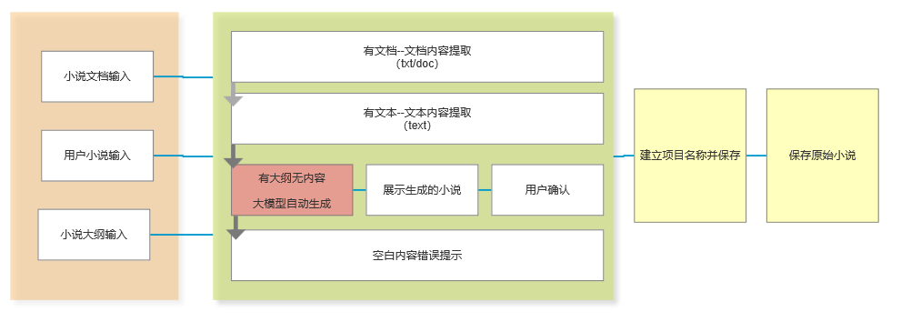
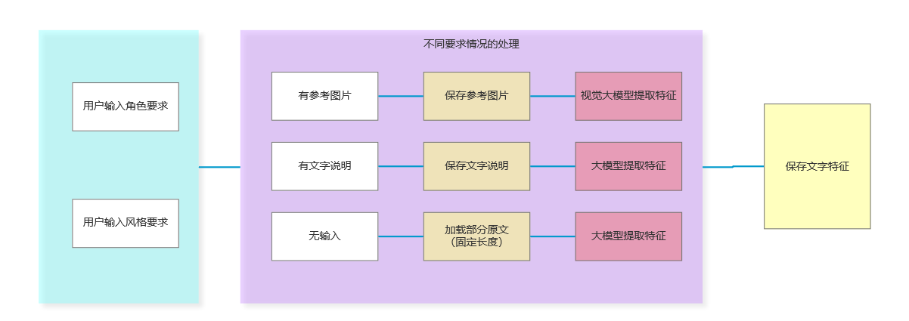
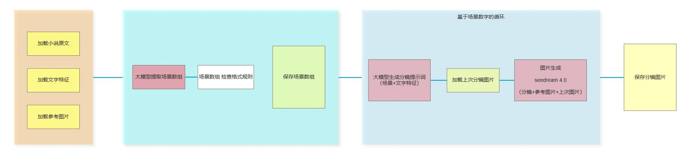

# manga-factory


一个基于AIGC技术的智能漫画生成系统，能够将小说文本自动转换为高质量的漫画作品。本项目融合了大型语言模型(LLM)和文生图(Text-to-Image)技术，为创作者提供高效、便捷的漫画创作工具。

## 🌟 项目特点

- 📚 **智能文本理解**：基于大型语言模型深度解析小说内容，理解情节、人物、情感和场景
- 🎬 **自动分镜生成**：智能将文本转换为漫画分镜设计，包括画面构图、角色动作和镜头语言
- 🎨 **风格一致性**：支持自定义漫画风格选择，并确保整部作品的画风和角色形象保持统一
- 🖼️ **高质量图像生成**：利用先进的文生图模型生成精美漫画画面
- 💬 **智能文本气泡**：自动识别分镜对话，合理放置对话和旁白文本
- 📖 **多样化排版**：支持多种漫画页面布局模板，如四格、六格等
- 🌐 **前后端分离**：采用现代Web架构，提供友好的用户界面和强大的后端服务


<div style="text-align: center;">
    <table style="margin: 0 auto;">
    <tr>
      <td></td>
      <td></td>
      <td></td>
      <td></td>
      <td></td>
    </tr>
    <tr>
      <td></td>
      <td></td>
      <td></td>
      <td></td>
      <td></td>
    </tr>
    </table>
    <p style="font-weight: bold; margin-bottom: 10px;">图片生成示例1</p>
</div>

<div style="text-align: center;">
    <table style="margin: 0 auto;">
    <tr>
      <td></td>
      <td></td>
      <td></td>
      <td></td>
      <td></td>
    </tr>
    <tr>
      <td></td>
      <td></td>
      <td></td>
      <td></td>
      <td></td>
    </tr>
    </table>
    <p style="font-weight: bold; margin-bottom: 10px;">图片生成示例2</p>
</div>


## 🏗️ 技术架构

本项目采用前后端分离的架构设计，主要包含以下组件：

| 组件 | 技术选型 | 主要职责 |
| :--- | :--- | :--- |
| **前端 (Frontend)** | React 19.1.1 + TypeScript + Vite + Ant Design | 提供用户交互界面，包括文本输入、风格选择、漫画预览与下载 |
| **后端 (Backend)** | Python 3.8+ (Flask 2.3.3) | 处理核心业务逻辑，包括文本处理、与AIGC服务交互、任务管理 |
| **AIGC服务** | 火山引擎/阿里云 AIGC | 提供底层的LLM（Doubao）、文生图（qwen_image）能力 |
| **数据库** | SQLite + SQLAlchemy | 存储用户信息、项目文件、生成的漫画数据、角色设定等 |
| **任务队列** | Redis | 管理耗时的AIGC生成任务，实现异步处理，避免请求超时 |

### 系统工作流程

1. **文本输入与预处理**：用户输入小说文本，系统进行预处理和场景切分
2. **角色与风格设定**：用户定义角色特征和选择漫画风格
3. **分镜脚本生成**：LLM将场景细化为详细的漫画分镜描述
4. **图像生成**：文生图模型根据分镜描述生成漫画图像
5. **文本气泡处理**：智能识别画面留白区域，放置对话和旁白
6. **页面合成**：按照预设布局将分镜组合成完整漫画页面
7. **输出与分享**：提供在线预览和多种格式的导出功能

<div style="text-align: center;">
    <table style="margin: 0 auto;">
    <tr>
      <td></td>
    </tr>
    <tr>
      <td></td>
    </tr>
    <tr>
      <td></td>
    </tr>
  </table>
  <p style="font-weight: bold; margin-bottom: 10px;">工作流结构组成示意图</p>
</div>

## 📦 安装指南

### 环境要求

- Python 3.8+
- Node.js 14+
- Redis 6+ (可选，用于缓存和任务队列)
- npm 7+ (用于前端依赖管理)

### 快速安装

1. **克隆仓库**
   ```bash
   git clone https://github.com/your-username/manga-factory.git
   cd manga-factory
   ```

2. **创建虚拟环境**
   ```bash
   # 在项目根目录下创建虚拟环境
   python -m venv venv
   
   # 激活虚拟环境
   # Windows:
   venv\Scripts\activate
   # macOS/Linux:
   source venv/bin/activate
   ```

3. **后端安装**
   ```bash
   cd backend
   pip install -r requirements.txt
   ```

4. **前端安装**
   ```bash
   cd frontend
   npm install
   ```

   前端主要依赖包括：
   - React 19.1.1
   - TypeScript
   - Vite 7.1.7
   - Ant Design 5.27.6
   - Tailwind CSS 4.1.15
   - React Router DOM 7.9.4
   - Axios 1.12.2

   后端主要依赖包括：
   - Flask 2.3.3
   - Flask-CORS 4.0.0
   - Flask-SQLAlchemy 3.0.5
   - PyMySQL 1.1.0
   - volcengine-python-sdk 1.0.50
   - python-dotenv 1.0.0
   - requests 2.31.0

5. **环境配置**
   ```bash
   cp .env.example .env
   # 编辑 .env 文件，填入必要的配置
   ```
   
   环境变量说明：
   - `SECRET_KEY`: 应用程序密钥，用于会话加密（默认值：supersecretkey）
   - `JWT_SECRET_KEY`: JWT令牌密钥，用于身份验证（默认值：jwt-secret）
   - `SQLALCHEMY_DATABASE_URI`: 数据库连接字符串（默认值：sqlite:///app.db）
   - `REDIS_URL`: Redis连接字符串（默认值：redis://localhost:6379/0）
   
   注意：生产环境中请务必修改默认密钥值，使用强密码。

6. **数据库初始化**
   ```bash
   # 运行数据库初始化
   cd backend
   python init_db.py
   ```

### Docker部署

```bash
# 构建并启动所有服务
docker-compose up -d
```

## 🚀 快速开始

### 基本使用

1. **启动后端服务**
   ```bash
   # 确保虚拟环境已激活
   cd backend
   python app.py
   ```

2. **启动前端服务**
   ```bash
   cd frontend
   npm run dev
   ```

3. **访问应用**
   打开浏览器访问 `http://localhost:5173`


## 📖 使用指南

### Web界面使用

1. **文本输入**：在主界面输入或上传小说文本
2. **参数设置**：选择漫画风格、定义角色特征、设置页面布局
3. **生成漫画**：点击生成按钮，系统将自动处理并生成漫画
4. **预览与编辑**：查看生成的漫画，可对分镜进行微调
5. **导出分享**：选择导出格式（PDF、图片集等）保存或分享作品


## 🎨 漫画风格示例

| 风格名称 | 示例图片 | 描述 |
| :--- | :--- | :--- |
| **日漫风格** |  | 经典日本动漫风格，线条简洁，色彩鲜明 |
| **美漫风格** |  | 美式漫画风格，线条粗犷，色彩浓郁 |
| **写实风格** |  | 接近真实世界的绘画风格，细节丰富 |
| **Q版风格** |  | 可爱Q版风格，角色比例夸张，表情丰富 |

## 📁 项目结构

```
manga-factory/
├── backend/                 # 后端Flask应用
│   ├── app.py              # 主应用入口
│   ├── config.py           # 配置文件
│   ├── models.py           # 数据模型
│   ├── extensions.py       # Flask扩展初始化
│   ├── init_db.py          # 数据库初始化脚本
│   ├── middlewares/        # 中间件
│   │   └── auth_required.py
│   ├── routes/             # 路由
│   │   ├── auth.py         # 认证相关路由
│   │   └── captcha.py      # 验证码路由
│   ├── services/           # 业务服务
│   │   └── doubao_service.py # 豆包AI服务
│   └── utils/              # 工具函数
│       ├── crypto_utils.py
│       ├── email_utils.py
│       ├── jwt_utils.py
│       └── response_utils.py
├── frontend/               # 前端React应用
│   ├── src/
│   │   ├── components/     # 组件
│   │   ├── pages/          # 页面
│   │   │   ├── LandingPage.tsx
│   │   │   ├── Login.tsx
│   │   │   ├── Register.tsx
│   │   │   ├── Chat.tsx
│   │   │   └── ...
│   │   ├── services/       # API服务
│   │   ├── utils/          # 工具函数
│   │   └── types/          # TypeScript类型定义
│   └── package.json
└── doc/                    # 文档
    ├── prompt/             # AI提示词模板
    ├── images/             # 图片资源
    └── ...
```

## 📚 项目文档

- [需求文档](doc/小说生成漫画应用_-_需求文档.md) - 详细的产品需求和用户分析
- [实现方案](doc/小说生成漫画应用_-_产品实现方案.md) - 技术架构和实现细节
- [AI提示词模板](doc/prompt/) - 各种AI生成任务的提示词模板

## 🔧 核心功能

### 用户认证系统
- 用户注册与登录
- JWT令牌认证
- 验证码验证
- 密码加密存储

### AI生成功能
- **智能分镜**：AI自动分析小说情节，拆分为连贯的漫画分镜布局
- **角色生成**：根据文字描述创建个性化角色形象
- **场景生成**：根据小说描述生成漫画场景
- **对话气泡**：智能分配对话气泡位置

### 用户界面
- 响应式设计，支持多设备访问
- 直观的用户交互界面
- 实时预览生成的漫画
- 多种漫画风格选择

## 🤝 贡献指南

我们欢迎所有形式的贡献！无论是代码、文档、设计还是想法建议。

### 如何贡献

1. **Fork 本仓库**
2. **创建你的特性分支** (`git checkout -b feature/AmazingFeature`)
3. **提交你的更改** (`git commit -m 'Add some AmazingFeature'`)
4. **推送到分支** (`git push origin feature/AmazingFeature`)
5. **开启一个 Pull Request`

### 开发规范

- 遵循PEP 8 Python代码规范
- 提交信息采用[约定式提交](https://www.conventionalcommits.org/zh-hans/)格式
- 为新功能添加适当的测试
- 更新相关文档

### 环境变量配置

在backend目录下创建.env文件，配置以下环境变量：
```
# 数据库配置
DATABASE_URL=sqlite:///manga_factory.db

# JWT配置
JWT_SECRET_KEY=your_secret_key_here
JWT_ACCESS_TOKEN_EXPIRES=3600

# Redis配置（可选）
REDIS_URL=redis://localhost:6379/0

# 火山引擎配置
VOLCENGINE_ACCESS_KEY=your_access_key
VOLCENGINE_SECRET_KEY=your_secret_key
VOLCENGINE_REGION=cn-beijing
VOLCENGINE_SERVICE_ID=your_service_id
```

## 🐛 问题反馈

如果您在使用过程中遇到任何问题，请通过以下方式反馈：

- [提交Issue](https://github.com/yourusername/manga-factory/issues)
- 发送邮件至：your.email@example.com

## 📄 许可证

本项目采用 [MIT 许可证](LICENSE)。

## 🙏 致谢

感谢以下开源项目和服务：

- [Flask](https://flask.palletsprojects.com/) - 轻量级Web框架
- [React](https://reactjs.org/) - 用户界面构建库
- [SQLite](https://www.sqlite.org/) - 轻量级数据库
- [Redis](https://redis.io/) - 内存数据结构存储
- [火山引擎](https://www.volcengine.com/) - 提供AIGC服务支持
- [Tailwind CSS](https://tailwindcss.com/) - 实用优先的CSS框架
- [Ant Design](https://ant.design/) - 企业级UI设计语言

## 🌟 Star History

[](https://star-history.com/#your-username/manga-factory&Date)

## 📧 联系我们

- 项目主页: https://github.com/TTboyi/manga-factory
- 邮箱: your-email@example.com
- 官方网站: https://manga-factory.com


