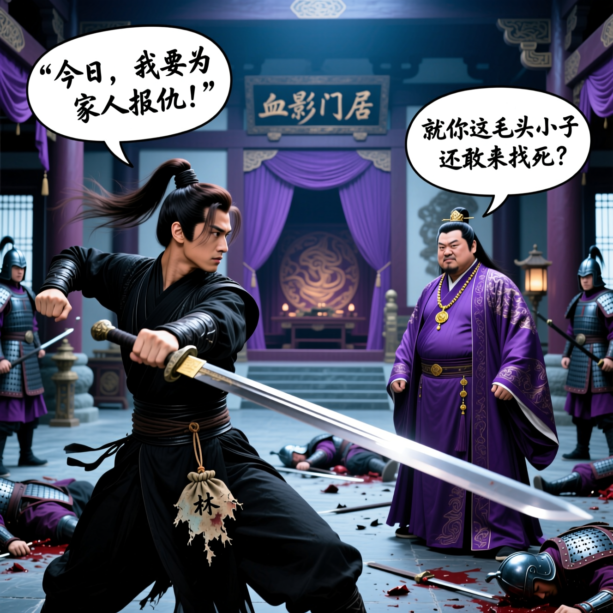
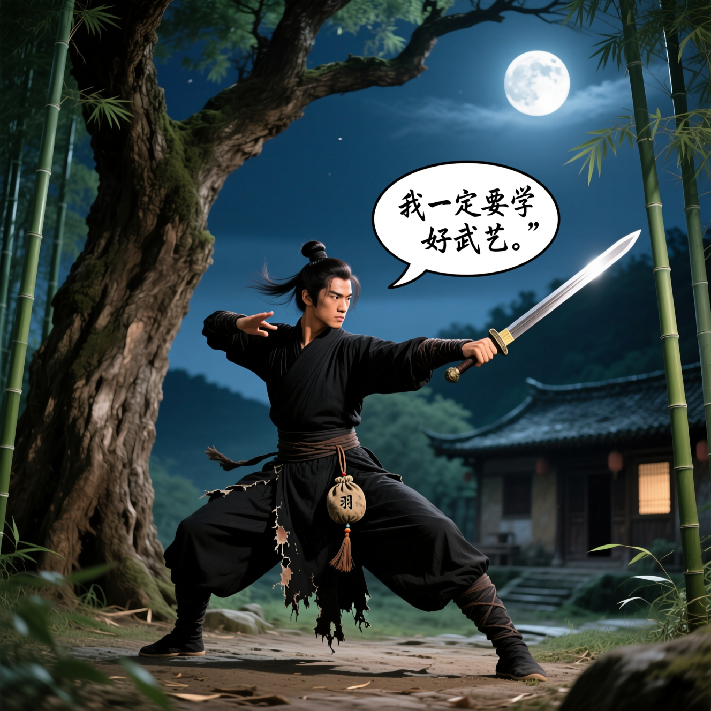
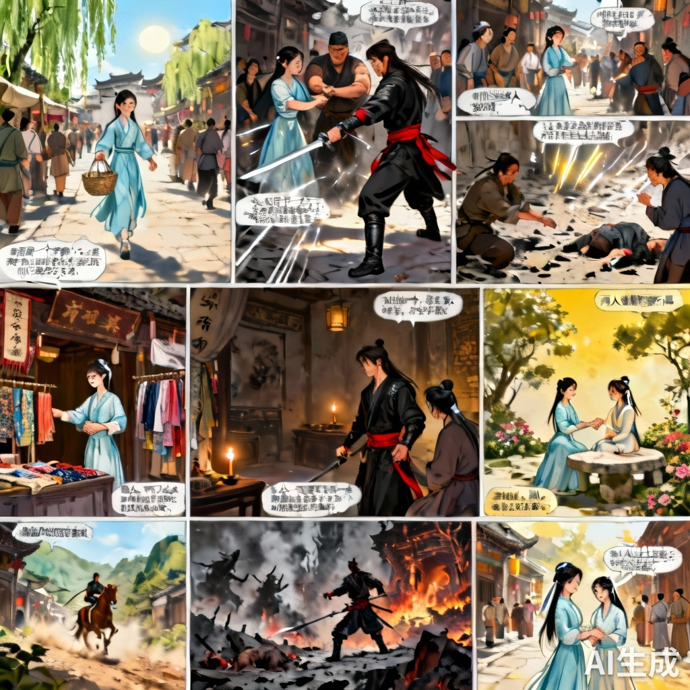
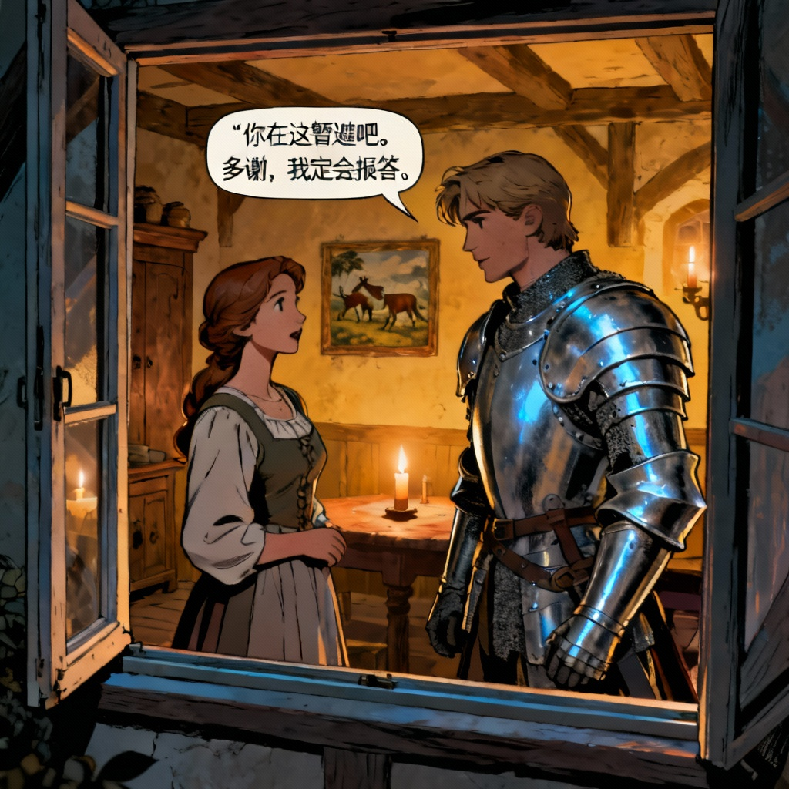
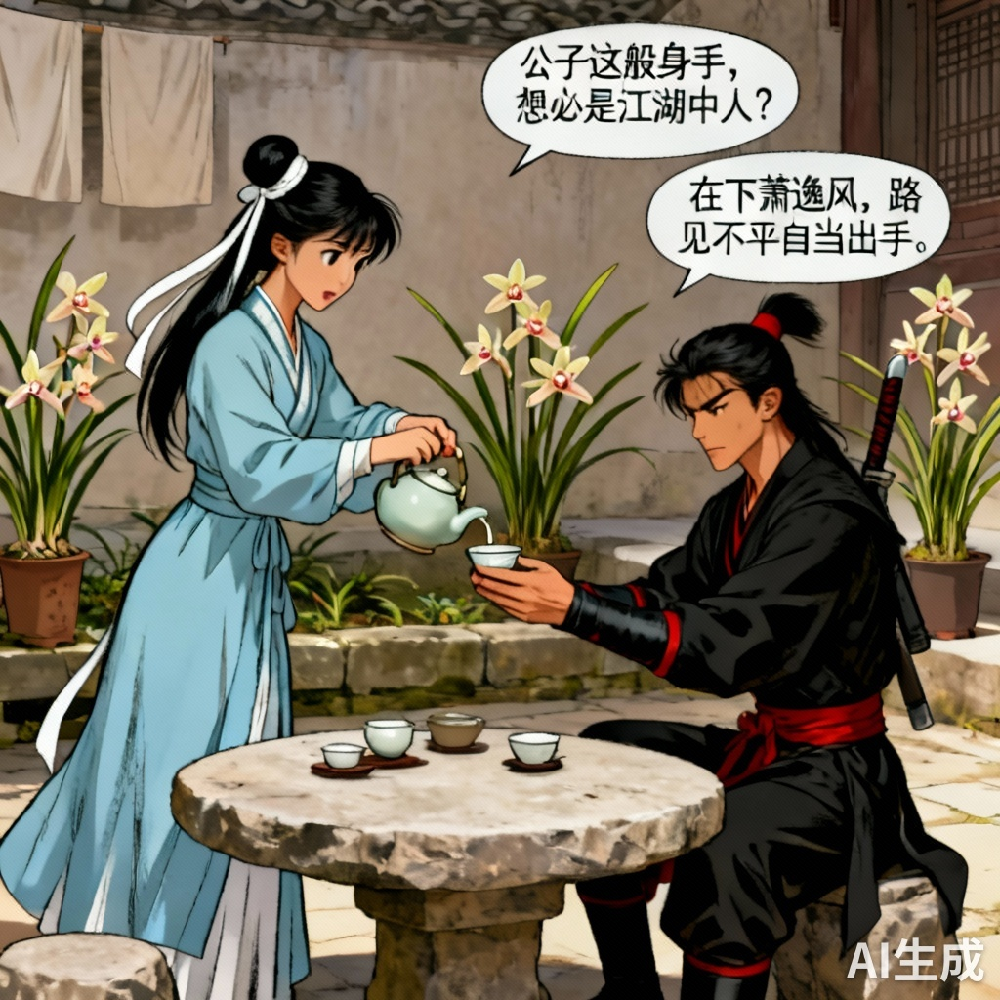

# 小说生成漫画应用 - 需求文档

**文档版本：** v1.2
**编写日期：** 2025年10月20日
**最后更新：** 2025年10月26日
**作者：** AI + 人工

## 1. 产品概述

本产品旨在开发一款基于AIGC技术，能够将小说文本自动转化为系列漫画的应用。该应用将为小说作者、漫画爱好者、教育工作者和内容营销人员等提供高效、便捷的漫画创作工具，降低漫画创作门槛，提升视觉叙事效率。产品核心功能包括小说文本深度理解、智能分镜生成、角色与风格统一的图像绘制，以及漫画页面排版与输出。

## 2. 用户分析

### 2.1 目标用户群体

本产品主要面向以下四类用户，旨在满足他们将文字内容视觉化的需求：

1.  **小说作者/文学爱好者：** 这类用户拥有丰富的文字创作或阅读经验，但通常缺乏专业的绘画技能和将文字视觉化的能力。他们希望能够快速、直观地展示故事情节，吸引更多读者或分享创意。
2.  **独立漫画创作者/插画师：** 尽管具备绘画基础，但他们在漫画创作的初期阶段，如分镜构思、草图绘制和风格探索时，可能面临效率瓶颈。他们寻求AI工具辅助，以加速创作流程并探索更多视觉可能性。
3.  **教育工作者/学生：** 在教学和学习场景中，将抽象的文字知识转化为生动有趣的漫画形式，有助于提高学生的学习兴趣和理解效率。这类用户通常不具备专业的绘画技能。
4.  **内容营销人员/自媒体：** 面对快速变化的内容消费市场，他们需要持续产出高质量、吸引眼球的视觉内容。漫画作为一种受欢迎的媒介，能够有效提升内容的传播力和用户互动。

### 2.2 用户痛点

本产品致力于解决用户在漫画创作过程中面临的以下核心痛点：

*   **高创作门槛：** 传统漫画创作对绘画技能、分镜能力和时间投入要求极高，非专业人士难以涉足。
*   **低创作效率：** 即使是专业创作者，从文字到漫画的整个流程（角色设计、场景绘制、分镜布局、色彩填充等）也极为耗时。
*   **风格统一性难题：** 在长篇漫画中保持角色形象、画风、色彩等视觉元素的一致性，是创作过程中的一大挑战。
*   **创意枯竭与灵感缺乏：** 创作者有时会遭遇灵感瓶颈，需要新的视角和辅助工具来激发创意。
*   **高昂的制作成本：** 雇佣专业团队进行漫画改编或插画创作的成本巨大，限制了个人创作者和小型团队的尝试。

### 2.3 用户故事

以下用户故事描绘了不同用户如何通过本产品解决其痛点并实现创作目标：

*   **小说作者小李：** 作为一名小说作者，我希望能够将我的小说快速转化为视觉化的漫画，以便向读者展示故事的魅力，并吸引更多潜在读者。
*   **漫画爱好者小王：** 作为一名漫画爱好者，我希望能够将我喜欢的网络小说制作成同人漫画，以便与同好分享，并锻炼自己的故事视觉化能力。
*   **历史老师张老师：** 作为一名历史老师，我希望能够将复杂的历史事件和人物故事制作成漫画，以便让学生更容易理解和记住，提高课堂的趣味性。
*   **自媒体运营小陈：** 作为一名自媒体运营者，我希望能够快速生成与热门话题相关的故事漫画，以便在社交媒体上发布，吸引粉丝并提高互动率。

## 3. 产品功能

本产品将提供以下核心功能：

### 3.1 小说文本输入与解析

*   支持用户上传或粘贴小说文本。
*   系统自动对文本进行预处理，包括分词、去除无关字符等。
*   利用大型语言模型（LLM）对小说内容进行深度理解，识别章节、人物、地点、事件、情感等关键元素，并进行初步的场景切分。

### 3.2 智能分镜生成

*   根据小说文本内容，LLM自动生成详细的分镜描述（Prompt），包括画面主体（角色动作、表情）、场景环境（背景、道具、氛围）、镜头语言（视角、构图、光影）和对话/旁白。
*   支持用户对AI生成的分镜描述进行编辑和微调，以实现个性化控制。

### 3.3 漫画风格与角色管理

*   提供多种预设漫画风格供用户选择（如日漫、美漫、写实、Q版等）。
*   支持用户上传角色参考图或通过文本描述定义角色特征，以确保角色在不同分镜中的一致性。
*   系统将用户选择的风格和角色特征应用于后续的图像生成过程。

### 3.4 图像生成

*   将分镜描述转化为文生图模型（Text-to-Image）的输入，生成对应的漫画图像。
*   通过统一的风格描述和角色特征注入，确保整部漫画的画风和角色形象保持一致性。
*   支持用户对生成的图像进行局部调整或重新生成。

### 3.5 文本气泡与页面排版

*   自动从小说中提取对话和旁白，并生成不同形状和风格的文本气泡。
*   智能识别图像中的视觉重点和留白区域，将文本气泡合理地放置在画面中，避免遮挡关键元素。
*   支持用户手动调整文本气泡的位置、大小、字体和颜色。
*   提供多种漫画页面布局模板（如四格、六格），用户可选择并调整分镜在页面中的位置和大小。

### 3.6 漫画预览与输出

*   提供在线漫画预览功能，用户可实时查看生成效果。
*   支持将生成的漫画导出为多种格式，如图片集（PNG/JPG）、PDF文档。

## 4. 产品实现挑战与应对策略

| 挑战 | 描述 | 应对策略 | 注释 |
| :--- | :--- | :--- | :--- | 
| **小说文本深度理解与分镜拆解** | 小说文本复杂，需准确理解情节、人物、情感，并合理拆解为视觉分镜。 | 采用先进NLP技术（NER、关系抽取、事件抽取）进行语义分析；利用LLM构建故事图谱，生成详细分镜描述（Prompt）；提供用户编辑分镜描述的界面。 |```json "shot_id": 1,"description": { "人物":"林夏","情节":"被拒多次后，林夏在出租屋最终决定去上海投稿试试"， "画面主体": "清晨的出租屋内，主角林夏（25岁，短发，穿宽松白衬衫）正弯腰把最后一本小说塞进纸箱，额角有细汗，神情疲惫却坚定。","场景环境": "老旧的单间，墙面剥落，阳光透过百叶窗在地板上切出条纹；角落堆满打包好的纸箱，唯一的书桌上摆着一只空咖啡杯和一张车票。","镜头语言": "室内广角（约24mm），低机位仰拍林夏侧面，利用百叶窗的投影形成前景条纹，背光使人物边缘微亮，整体呈冷灰调。","对话/旁白": "（林夏）：‘离开需要勇气，但留下只会让我腐烂。’" }``` |
| **图像生成中的角色一致性与风格统一** | 同一角色在不同分镜需保持形象一致，整部漫画画风需统一。 | 允许上传角色参考图，利用视觉大模型进行特征提取确保角色一致性；通过统一Prompt保持整体风格。 | 通过大模型对人物的体态，肤色，配饰，武器/工具，服饰，发型等进行提取（当原文中的人物外貌描写不突出，或者没有提及时，自主结合小说内容，为角色设定突出外貌特征。），生成角色特征描述，从片段的情节、氛围、人物塑造等方面入手，分析适合的漫画视觉化表达风格。以结构化的方式，清晰阐述所选取风格的特点。注入到生成图像提示词的模型中。 |
| **复杂场景与抽象概念的视觉化** | 宏大复杂场景或抽象概念难以直接转化为具象图像。 | LLM将复杂场景拆解为可视觉化元素，图像生成模型逐一生成或组合；提供多视角与构图建议；允许用户上传自定义风格融合。 | 当用户提供场景、角色描述、风格描述后，快速且精准地生成漫画分镜脚本。清晰界定画面主体，细腻描绘场景环境，精准运用镜头语言，合理规划对话或旁白。   |
| **文本气泡、排版与画面布局自动化** | 对话、旁白需合理布局在画面中，避免遮挡关键元素。 | LLM提取对话生成文本气泡；结合图像生成模型（qwen_image）设置生成文本气泡；实现自动调整文字样式。 |   [镜头距离], [角色(详细特征）+动作], [场景], [情绪打光], [画面风格], screentone, 600 dpi, [位置] integrated speech bubble with hand-lettered text: “要写的对话或旁白” tail points to [谁]|
| **生成效率与资源消耗** | AIGC模型计算量大，生成耗时耗资源。 | 采用flash模型（doubao-1.6-flash）加速生成速度。 |  极致推理速度的多模态深度思考模型；同时支持文本和视觉理解。qwen-image-plus 0.2元/张、qwen-image 0.25元/张，作为对比 doubao-seedream-4.0  0.2元/张  doubao-seedream-3.0-t2i  0.259元/张 |
| **版权与伦理问题** | AI生成内容可能存在版权争议和不当内容风险。 | 确保使用训练数据来源合法的平台，明确AI生成内容的版权归属。图片基于大模型生成的描述生成，对提示词引入内容检测；建立内容审核与过滤机制； |
----

## 5. 计划采纳的AIGC功能与模型选择

考虑到竞赛要求（不能调用第三方Agent，仅允许调用LLM、各类AIGC模型和语音TTS能力），我们选择doubao-1.6-flash服务作为核心AIGC能力提供商。

**模型选型对比分析：**

| 特性/服务商 | OpenAI (GPT系列, DALL-E 3, TTS) | Google (Gemini系列, Imagen, Chirp) | Stability AI (Stable Diffusion系列) | Midjourney (非API优先)       | 火山引擎（VeCloud） | 阿里云(qwen-image) |
| :---------- | :------------------------------ | :--------------------------------- | :---------------------------------- | :---------------------------- | :------------------ | :------------------ |
| **LLM能力**   | 优秀 (GPT-4o, GPT-4)            | **优秀 (Gemini 1.5 Pro)**          | 无                                | 无                           | 优秀 (doubao-1.6) |  优秀（qwen-3/qwen-image）    |  
| **文生图能力**  | 优秀                            | 优秀                              | 良好                              | 优秀 (但API受限)              |优秀             |   优秀（高还原文本）      |
| **API易用性** | 良好                            | 良好                               | 良好                                | 差 (主要通过Discord Bot)      |良好              |       良好       |
| **可控性**    | 良好 (Prompt)                   | **良好 (Prompt)**                  | 优秀 (ControlNet, LoRA)             | 良好 (Prompt)                 |良好              |       良好       |
| **成本**      | 较高                            | **中等**                           | 较低 (开源模型可本地部署)              | 较高 (订阅制)                 |较低             |        较低             |
| **生态系统**  | 丰富                            | **丰富**                           | 丰富 (开源社区)                     | 封闭                          |丰富              |        丰富             |

**采纳模型选择：** doubao-1.6-flash系列 (LLM) + qwen-Imagen (文生图)

**当前实际使用模型：**
- LLM模型：doubao-1.6-flash (用于文本理解、分镜生成和对话提取)
- 文生图模型：qwen-Imagen (用于漫画图像生成)
- TTS模型：根据需要可集成火山引擎TTS服务 

**选择理由：**

1.  **综合能力领先：** 从LLM到文生图、再到TTS的全面AIGC能力。在生成速度方面表现卓越，非常适合小说这种复杂文本的快速处理。qwen-Imagen 在文字图像生成质量和可控性方面也表现出色，可直接生成可用对话气泡。
2.  **API易用性与集成：** 火山引擎/阿里云 AI的API设计成熟，文档完善，便于开发者快速集成和使用，这对于竞赛项目至关重要。
3.  **符合竞赛要求：** 提供的均为基础模型服务多样，可以满足竞赛中“不能调用第三方Agent能力，只需允许调用LLM、各类AIGC模型和语音TTS能力”的限制。
4.  **稳定性与可扩展性：** 作为大型云服务提供商，火山引擎/阿里云 AI的API服务具有良好的稳定性、可扩展性，能有效支持开发和测试需求。


<div style="text-align: center;">
    <table style="margin: 0 auto;">
    <tr>
      <td></td>
      <td></td>
      <td></td>
    </tr>
  </table>
  <p style="font-weight: bold; margin-bottom: 10px;">Qwen_image生成示例</p>
</div>


**试错方案：**
1.**seedream（火山引擎）**：
   - 选择doubao-1.6-flash作为LLM模型，seedream 4.0作为文生图模型。
   - 设想：自动适配最优的图像比例尺寸与生成数量，可一次性连续输出最多 15 张内容关联的图像，支持 4K 超高清输出。
   - 利用火山引擎的API接口，快速集成和调用这两个模型。
   - **文本内容生成质量不足，不能够满足对文本生成的要求。**


<div style="text-align: center;">
    <table style="margin: 0 auto;">
    <tr>
      <td></td>
      <td></td>
      <td></td>
    </tr>
  </table>
  <p style="font-weight: bold; margin-bottom: 10px;">seedream4.0生成示例</p>
</div>


## 6. 未来规划中的功能

为持续提升用户体验和产品竞争力，未来将考虑以下功能：

1.  **高级风格定制与学习：** 允许用户上传绘画作品或风格样本，AI学习并模仿其独特风格，并提供更细致的风格参数调整。这将极大提升产品的个性化和专业性。
2.  **多模态交互与动态漫画：** 拓展输入方式至语音、草图、视频片段等，并探索生成带有简单动画效果的动态漫画，或集成TTS能力为漫画配音。这将增强漫画的沉浸感和表现力。
3.  **智能分镜编辑与布局优化：** 提供更智能的分镜编辑界面，支持拖拽、缩放分镜时自动调整布局，并引入“智能构图助手”推荐最佳构图方案。这将提高用户对漫画布局的掌控力。
4.  **角色表情与动作库：** 建立丰富的角色表情和动作库，支持用户选择或通过描述生成，AI还能根据情节自动推荐。这将使漫画人物更加生动，更好地传达情感。
5.  **社区分享与协作功能：** 建立用户社区，支持作品分享、风格模型（LoRA）交流和多用户协作创作。这将激发创作热情，扩大产品使用场景，并可能催生高质量UGC内容。


这些功能旨在将产品从一个基础的“小说转漫画”工具，发展成为一个功能强大、高度个性化、具备社交属性的综合性漫画创作平台，以应对市场竞争并持续为用户创造价值。

---


